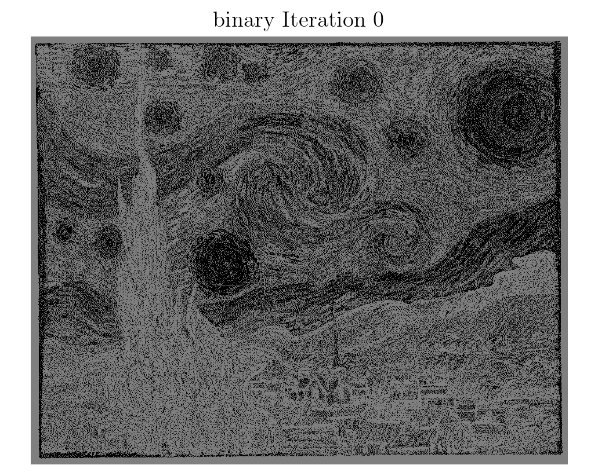
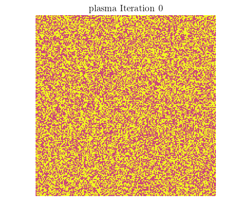

# conway-game-of-life


## Description
This game is a cellular automaton devised by the mathematician John Conway to highlight that the evolution is determined by an initial state.

The Game of Life, a.k.a. Life, is a cellular automaton conceptulaized by the British Mathematician John Horton Conway in 1970. It is a zero-player game, meaning that its evolution is determined by its initial state, requiring no further input. This game starts with a random state of cells that propogate into interesting patterns and outcomes. It is Turing complete and can simulate a universal constructor or any other Turing machine.

The universe of the Game of Life is an infinite, two-dimensional orthogonal grid of square cells, each of which is in one of two possible states, live or dead, (or populated and unpopulated, respectively). Every cell interacts with its eight neighbours, which are the cells that are horizontally, vertically, or diagonally adjacent. 

At each step in time, the following transitions occur:

1. Any live cell with fewer than two live neighbours dies, as if by underpopulation.
2. Any live cell with two or three live neighbours lives on to the next generation.
3. Any live cell with more than three live neighbours dies, as if by overpopulation.
4. Any dead cell with exactly three live neighbours becomes a live cell, as if by reproduction.

These rules, which compare the behavior of the automaton to real life, can be condensed into the following:

1. Any live cell with two or three live neighbours survives.
2. Any dead cell with three live neighbours becomes a live cell.
3. All other live cells die in the next generation. Similarly, all other dead cells stay dead.

With these ground rules laid out, this Python implementation is very expandable and auto-complies to a .gif for easy viewing


## Table of Contents
- [Installation](#installation)
- [Usage](#usage)
- [Credits](#credits)
- [License](#license)
## Installation
The local dependacies are [imageio](https://pypi.org/project/imageio/):


```
pip install imageio
```

And optionally a locally installed [LaTeX interpreter](https://sourabhbajaj.com/mac-setup/LaTeX/)(Comment out the plt.rc() lines in *main.py* to avoid installation), all this is needed is for styling
```
brew install --cask basictex
```


## Usage

With all the dependencies installed, the script should be able to run without much modification. To keep the first runtime down there's a temporary line that says

```
maplist = ['gist_earth']    # Comment this line to run the entire cmap dictionary found in maps.json
```

Comment this line out when ready to run the full script, the time to run will vary but it will take several hours to complete. If you would like to run Conway's Game of Life on photos put your target photo into *(root)/Figrep* and add it's entry into *image_names* list.

**Caution:** Large photos will take large amounts of computational power and will likely result in longer run times

---
